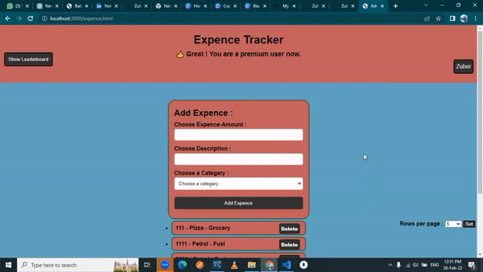

<h1 align="center">Hi 👋, I'm Zuber</h1>
<h3 align="center">Wellcome to my Expence-Tracker project</h3>

- 🌱 Frontend : **HTML, CSS, Java Script**
- 🌱 Backend :  **Express JS, Node JS, MySQL**
- 🌱 Implimented user Authentication feature with the help of **Jsonwebtoken**.
- 🌱 Implimented hashing password feature using **Bcrypt** Library.
- 🌱 Integrated mailing services via **SendInBlue**.
- 🌱 Implimented Payment Gateway to handle payments using **Razorpay**.
- 🌱 Implimented report generation and download report features **ASW S3 bucket**.
- 🌱 Deployment : **AWS**
